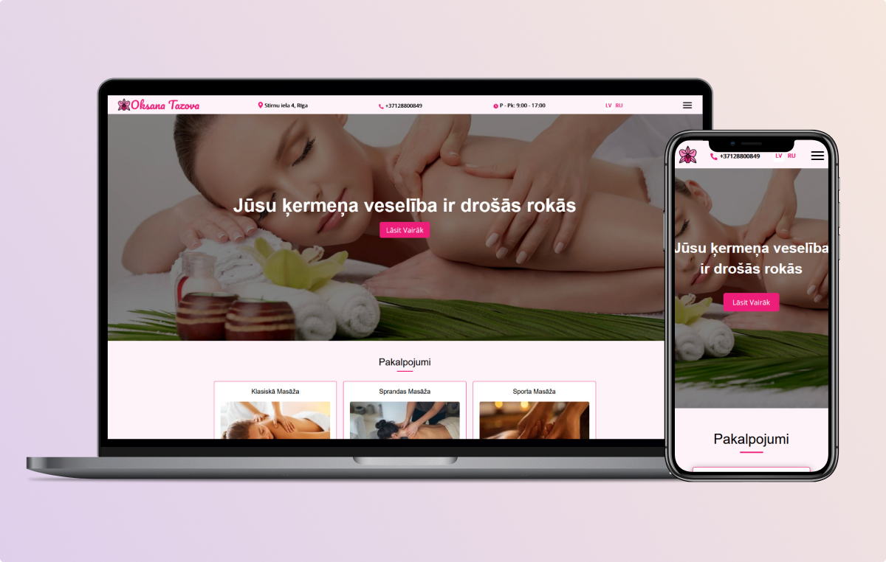

# Massage Therapist Website Portfolio

## Overview

This website is built for the massage therapist Oksana Tazova.

### Screenshot

### Links

- Live Site URL: [Demo](oksana-tazova.netlify.app)

## My process

### Built with

- Semantic HTML5 markup
- Flexbox
- CSS Grid
- [Saas](https://sass-lang.com/) - For styles
- [Jquery](https://jquery.com/) - For website functionality
- [GulpJs](https://gulpjs.com/) - Tasks manger

## Author

- Website - [Sergejs Ivcenko](https://portfolio-mu-lovat-62.vercel.app/)
- GitHUb - [Sergio0831](https://github.com/Sergio0831)
- LinkedIn - [Sergejs Ivcenko](https://www.linkedin.com/in/ivcenko/)
